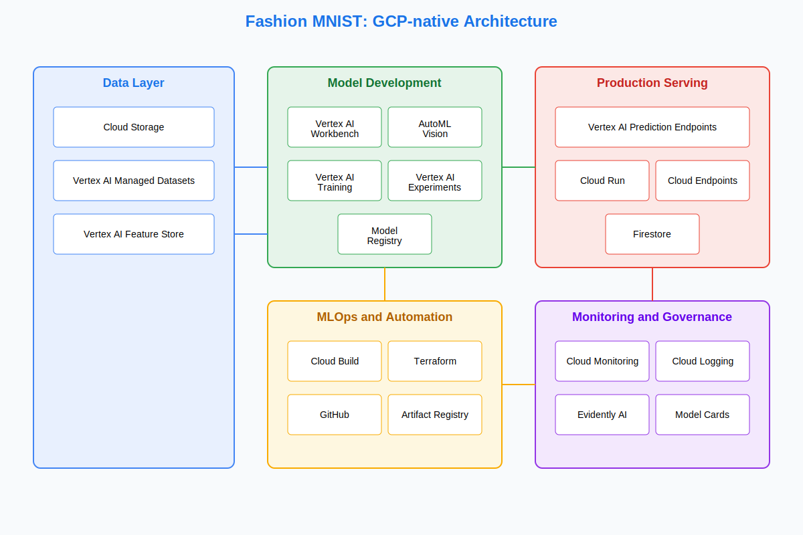

# Fashion MNIST: GCP-native Implementation

## Overview
This document outlines a professional ML Engineering implementation for the Fashion MNIST classification system using Google Cloud Platform (GCP) services. While Fashion MNIST is a well-understood dataset, this project deliberately focuses on demonstrating enterprise-grade ML engineering practices and comprehensive MLOps capabilities.

The implementation showcases proficiency across the complete ML lifecycle, emphasizing:
- Production-ready architecture that scales beyond Fashion MNIST
- MLOps best practices including feature management and model governance
- Cost-effective utilization of GCP managed services
- End-to-end ownership from data engineering to production monitoring

This GCP-native approach serves as part of a larger portfolio project demonstrating three implementation paradigms (Localized, GCP-Native, and Cloud Agnostic), highlighting technical versatility and professional ML engineering expertise.

## Phase 1: Project Creation and Setup
- Create GCP project and enable billing: **GCP Console, Cloud Billing**
- Set up IAM roles and service accounts: **IAM, Service Accounts**
- Initialize version control and CI/CD: **GitHub, Cloud Build**
- Configure infrastructure as code: **Terraform, Cloud Storage (backend)**
- Set up cost monitoring: **Budget Alerts, Cloud Monitoring**

## Phase 2: Data Engineering & Preparation
- Store and organize Fashion MNIST images: **Cloud Storage**
- Explore and visualize image data: **Vertex AI Workbench, Jupyter Notebooks**
- Preprocess and normalize images: **Cloud Functions**
- Create managed datasets with train/val/test splits: **Vertex AI Managed Datasets**
- Engineer and store reusable features: **Vertex AI Feature Store**

## Phase 3: Model Development & Training
- Train baseline model with AutoML: **Vertex AI AutoML Vision**
- Develop custom CNN models: **Vertex AI Workbench, TensorFlow/PyTorch**
- Execute distributed training jobs: **Vertex AI Training**
- Track experiments and parameters: **Vertex AI Experiments**
- Version and store models: **Vertex AI Model Registry**
- Document model architecture and decisions: **Model Cards, Cloud Storage**

## Phase 4: Model Evaluation & Validation
- Calculate classification metrics: **Vertex AI Model Evaluation**
- Generate confusion matrices and visualizations: **Matplotlib, Seaborn**
- Analyze model drift and performance: **Evidently AI**
- Compare multiple model versions: **Vertex AI Experiments**
- Store evaluation artifacts: **Cloud Storage**

## Phase 5: Deployment & Serving
- Deploy models to production endpoints: **Vertex AI Prediction**
- Configure auto-scaling and traffic management: **Vertex AI Endpoints**
- Serve features for real-time inference: **Vertex AI Feature Store**
- Create REST API for predictions: **Cloud Endpoints**

## Phase 6: Monitoring & Maintenance
- Monitor endpoint health and latency: **Cloud Monitoring**
- Track prediction requests and errors: **Cloud Logging**
- Detect data and concept drift: **Evidently AI, Vertex AI Model Monitoring**
- Monitor costs and resource usage: **Cloud Monitoring, Cost Management**
- Set up alerts for anomalies: **Cloud Monitoring Alerts**

## Phase 7: MLOps & Automation
- Automate model deployment pipeline: **Cloud Build, GitHub Actions**
- Manage infrastructure configuration: **Terraform**
- Store and version containers: **Artifact Registry**
- Manage secrets and credentials: **Secret Manager**
- Implement model governance checks: **Cloud Build (custom steps)**

## Phase 8: Presentation & Documentation
- Create web dashboard for model insights: **Cloud Run, Flask/Streamlit**
- Generate API documentation: **OpenAPI/Swagger**
- Document architecture and workflows: **Draw.io, Markdown**
- Create interactive analysis reports: **Jupyter Notebooks**
- Maintain model documentation: **Model Cards, Cloud Storage**

## Phase 9: Real-World Experimentation
- Deploy web application for image upload: **Cloud Run**
- Handle image preprocessing in browser: **JavaScript, HTML5**
- Process real-time classification requests: **Vertex AI Prediction**
- Collect user feedback and analytics: **Cloud Logging, Firestore**
- Monitor real-world performance: **Cloud Monitoring, Evidently AI**

## Key Implementation Principles
1. **Right-sized Solutions**: Using appropriate services for the Fashion MNIST scale
2. **Cost Optimization**: Leveraging preemptible VMs and auto-scaling appropriately
3. **Security Best Practices**: Implementing IAM with least privilege principle
4. **Automation Focus**: CI/CD pipelines and infrastructure as code
5. **Monitoring & Governance**: Comprehensive observability and model documentation

## Service Summary
- **Core ML Services**: Vertex AI suite (AutoML, Training, Experiments, Model Registry, Prediction, Feature Store)
- **Data & Storage**: Cloud Storage, Vertex AI Managed Datasets
- **Infrastructure**: Cloud Build, Cloud Run, Cloud Functions, Artifact Registry
- **Monitoring**: Cloud Monitoring, Cloud Logging, Evidently AI
- **Security**: IAM, Secret Manager
- **Development**: Vertex AI Workbench, GitHub, Terraform

This implementation provides a professional, production-ready ML system while maintaining appropriate complexity for the Fashion MNIST dataset. It demonstrates modern ML engineering practices without unnecessary over-engineering.